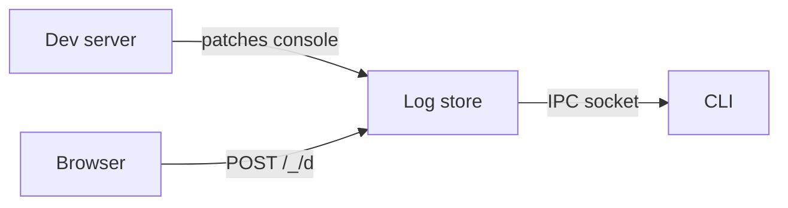

debugger is a dev-only observability layer for debugging applications.
It instruments your dev server, captures runtime data (console output,
errors, network requests, browser state), stores it in memory, and
exposes it through a CLI. There are no config files, no dashboards,
and no external services.

## How it works

debugger has three components that work together to give you
visibility into your running application.

- **Server instrumentation** patches console methods and starts an
  IPC bridge that holds captured data in memory.
- **Browser client** is an IIFE script injected into pages that
  captures client-side data and sends it back to the server.
- **CLI** connects to the bridge over IPC and queries stored data
  on demand.



## What's captured

debugger captures data from both the server and the browser
automatically once instrumentation is active.

### Server

Server-side instrumentation captures the following:

- Console output (`log`, `warn`, `error`, `debug`, `info`)
- Unhandled errors
- HTTP request metadata (method, path, status, duration)

### Browser

The browser client captures a wider range of data:

- Console output
- JavaScript errors and unhandled rejections
- Network requests (fetch, XHR, WebSocket)
- Cookies, localStorage, and sessionStorage
- Service workers, cache storage, permissions, and storage quota

The browser client detects 50+ browser types.

## Design principles

debugger follows a strict set of design principles that keep it
lightweight and out of your way.

- **Dev-only** — no-ops in production, zero runtime cost
- **Zero config** — works out of the box with one import
- **Zero dependencies** — no external packages in core
- **In-memory** — ring buffers, no disk writes, no persistent state
- **Language-agnostic** — same IPC protocol across Node.js, Go,
  Python, and Rust

```cards
# Installation
Install debugger and set up your framework.
/docs/introduction/installation

# Usage
Learn how to query logs and inspect your application.
/docs/introduction/usage

# CLI reference
Complete command and flag reference.
/docs/reference/cli
```
