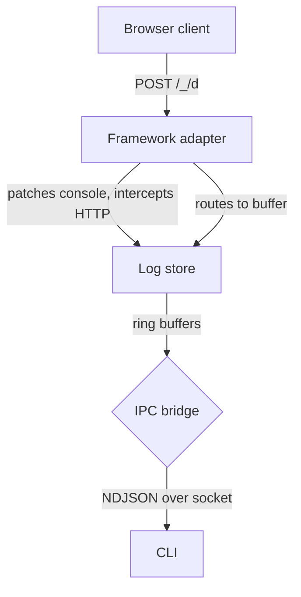

debugger is a three-part system: framework adapters capture runtime
data, an in-memory store holds it in ring buffers, and an IPC bridge
exposes it to the CLI. All communication uses NDJSON over Unix sockets
(macOS and Linux) or Windows named pipes.

## Data flow

The adapter instruments the dev server on startup. It patches console
methods to capture server-side output and registers HTTP middleware
to capture request metadata. The browser client sends data to the
adapter's ingest endpoint. Everything flows into the log store, which
the IPC bridge exposes for CLI queries.

## Components

debugger is composed of four main components. Each one has a single
responsibility and communicates through well-defined boundaries.

### Framework adapters

Framework adapters are language-specific integrations that hook into
each framework's dev server. Node.js adapters use Vite plugins,
Next.js instrumentation hooks, or Express-style middleware. Go,
Python, and Rust adapters use their native middleware patterns. Each
adapter creates a log store, patches logging, and starts the IPC
bridge.

### Log store

The log store routes entries into four ring buffers by type. Each
buffer has a fixed capacity and evicts the oldest entry when full.

| Buffer | Capacity | Entry type |
|--------|----------|------------|
| Console | 500 | `console` |
| Errors | 100 | `error` |
| Network | 300 | `network` |
| App state | 50 | `app` |

Ring buffers keep memory usage constant regardless of how long the
dev server runs. No entries are written to disk.

### IPC bridge

The bridge is a socket server that listens for NDJSON requests. Each
CLI invocation opens a connection, sends one request, receives one
response, and disconnects.

- **Unix/macOS**: `{project}/.debugger/bridge.sock`
- **Windows**: `\\.\pipe\debugger-{hash}` (first 8 characters of the
  MD5 hash of the working directory)

On startup, the bridge writes a `session.json` file to `.debugger/`
containing the session ID, framework name, port, and PID. The CLI
uses this file for session discovery. On shutdown, the socket and
session file are cleaned up.

### CLI

The CLI is a stateless query tool. It discovers the session by
reading `.debugger/session.json`, connects to the socket, sends a
query, formats the response, and exits. It doesn't run a background
process or maintain state between invocations.

## Session management

Each instrumented dev server creates a session with a unique ID
(format: `dev-{6 hex chars}`). The session tracks the framework
name, port, process ID, start time, and socket path.

When multiple dev servers run in the same project, the CLI discovers
all sessions by scanning for `.debugger/session.json` files up to
three directory levels deep. You can target a specific session with
`--port` or `--session`.

## Multi-language protocol

All language packages (Node.js, Go, Python, Rust) implement the same
NDJSON protocol. The CLI doesn't know or care what language the
server runs — it speaks the same protocol to all of them. See the
[protocol reference](/docs/reference/protocol) for the full specification.
